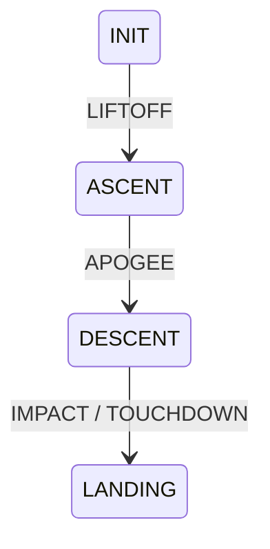

# 🚀 Estados del sistema – Misión AURORA

## 📌 Visión general

El CANSAT AURORA implementa una **máquina de estados finita (FSM)** para modelar el comportamiento del sistema durante toda la misión.

Cada estado representa una fase del vuelo y permite:

- Adaptar el comportamiento del sistema en tiempo real  
- Detectar eventos clave automáticamente  
- Activar subsistemas específicos (cámara, buzzer, LEDs, telemetría)  
- Estructurar el análisis posterior de la misión  

---

## 🧭 Estados del sistema

### 🔹 INIT (Inicialización)

Estado inicial tras el encendido del sistema.

**Funciones principales:**
- Inicialización de sensores (BMP280, MPU6050, GPS)  
- Inicialización de módulos (LoRa, microSD, cámara)  
- Espera de condiciones de misión (ARM o lanzamiento)  

**Condición de salida:**
- Detección de lanzamiento (LIFTOFF)

---

### 🔹 ASCENT (Ascenso)

Fase de subida del CANSAT tras el lanzamiento.

**Funciones principales:**
- Registro continuo de datos de sensores  
- Transmisión de telemetría en tiempo real (LoRa)  
- Monitorización de aceleración y altitud  

**Objetivo:**
- Detectar el final del ascenso (apogeo)

**Condición de salida:**
- Detección de apogeo (inicio de descenso)

---

### 🔹 DESCENT (Descenso)

Fase de caída controlada mediante paracaídas.

**Funciones principales:**
- Activación de captura de imágenes (ESP32-CAM)  
- Registro intensivo de telemetría  
- Monitorización de estabilidad y rotación  

**Objetivo:**
- Detectar el impacto y aterrizaje  

**Condición de salida:**
- Detección de impacto / touchdown

---

### 🔹 LANDING (Aterrizaje)

Fase final tras el contacto con el suelo.

**Funciones principales:**
- Confirmación de aterrizaje estable  
- Registro final de datos  
- Posible señalización (buzzer / LED)  
- Preparación para recuperación del dispositivo  

**Estado final de la misión**

---

## 🔄 Transiciones de estado

## 🧠 Detección de eventos

Las transiciones entre estados se basan en la detección de eventos mediante fusión de sensores.

Eventos principales:
- LIFTOFF
-- Incremento brusco de aceleración (MPU6050)
-- Variación rápida de altitud
- APOGEE
-- Cambio de tendencia en la altitud (máximo local)
-- Paso de ascenso a descenso
-IMPACT / TOUCHDOWN
-- Pico de aceleración (impacto)
-- Estabilización posterior (baja variación en IMU)
-- Posible apoyo con sensor acústico

---

## 🔧 Sensores implicados

- BMP280
--Altitud estimada (clave para detectar apogeo)
- MPU6050
--Aceleración (detección de lanzamiento e impacto)
--Rotación (estabilidad durante descenso)
- GPS NEO-6M
--Altitud y posición (validación adicional)
--Sistema acústico (opcional)
--Detección de impacto mediante sonido

---

## ⚙️ Integración con el sistema

La máquina de estados controla:

- Transmisión LoRa (frecuencia y contenido)
- Registro en microSD
- Activación de la cámara
- Señalización mediante LED y buzzer
- Generación de eventos (events.csv)

---

## 📈 Aplicación en análisis posterior

La estructura por estados permite:

- Segmentar la misión en fases
- Analizar comportamiento en cada etapa
- Correlacionar eventos con datos físicos
- Reconstruir el perfil completo del vuelo

---

## 📄 ➡️ Misión AURORA

Este sistema de estados forma el núcleo lógico de la misión, permitiendo una ejecución autónoma, robusta y alineada con arquitecturas reales utilizadas en sistemas aeroespaciales.
